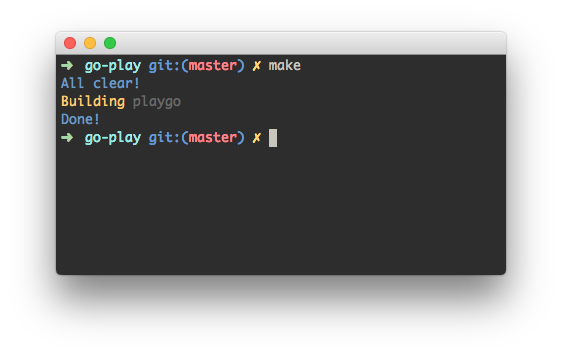
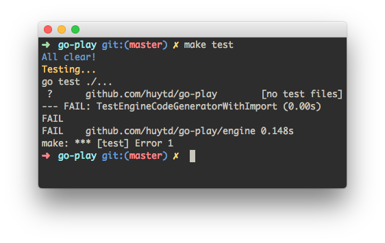
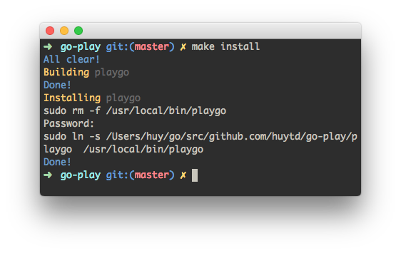

### Tự động build thành file binary với tên file được định sẵn

Chạy lệnh:

~~~commandline
make
~~~

### Chạy toàn bộ test của tất cả các packages trong project

Chạy lệnh:

~~~commandline
make test
~~~

### Build và install vào /usr/local/bin

Nếu viết các ứng dụng command line, thì chức năng này sẽ giúp tiết kiệm thời gian và có thể test thực tế trên môi trường của máy bằng cách copy file binary được build ra vào thư mục /usr/local/bin. Khi đó có thể chạy chương trình của mình ở bất kì thư mục nào trong máy tính.

~~~commandline
make install
~~~

Khi không cần dùng nữa hoặc muốn gỡ nó ra thì chạy:

~~~commandline
make uninstall
~~~

Copyright © https://kipalog.com/posts/Makefile-cho-Go